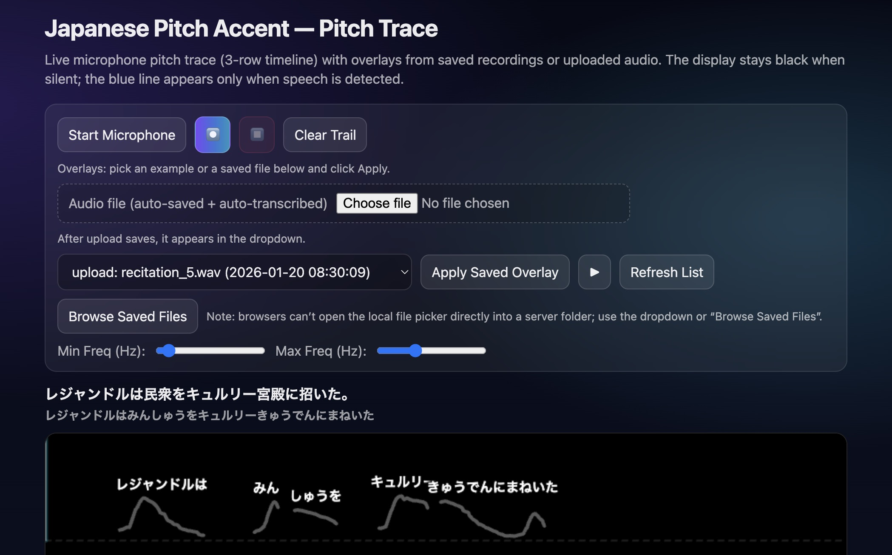
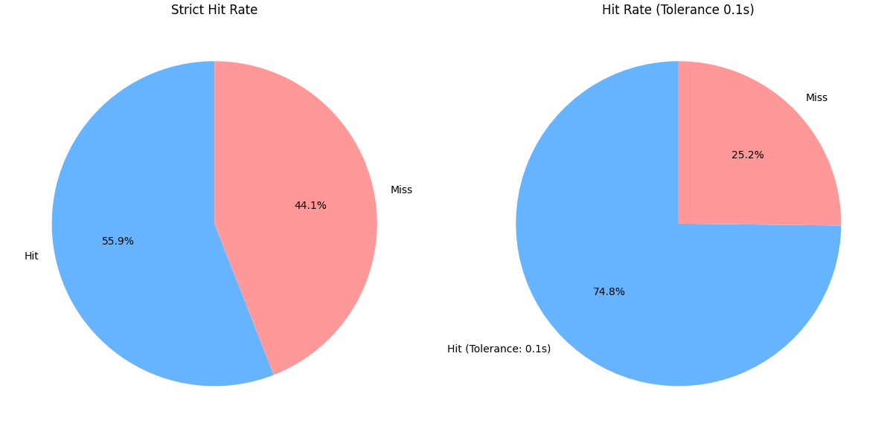
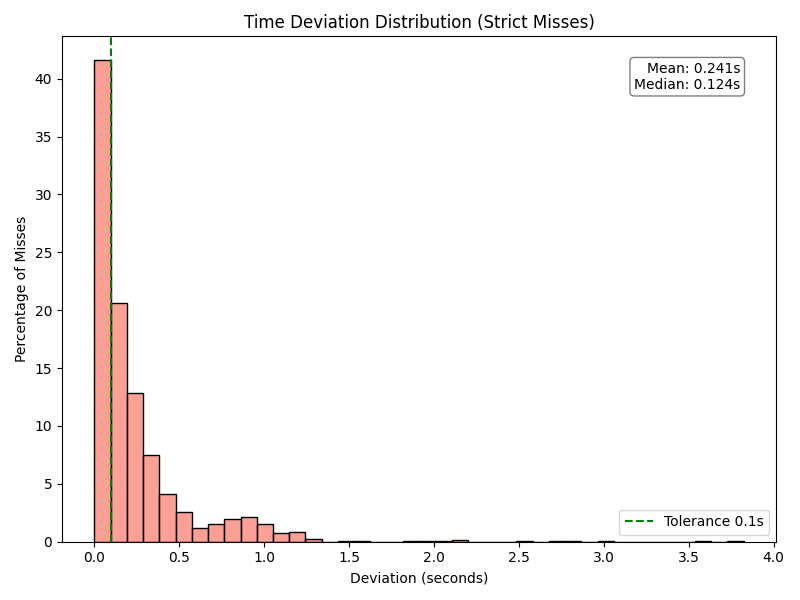

# Japanese Pitch Accent Trainer



A computer-assisted language learning (CALL) tool for mastering Japanese pitch accent. This project bridges the gap between raw acoustic pitch detection and linguistic prosody by visualizing the learner's pitch contour (F0) in real-time and aligning it with "Truth" trails from native audio.

## Key Features

- **Vertical Pitch Scaling**: Unlike standard spectrograms, this tool maps frequency to a semitone-based vertical axis, making pitch intervals visually intuitive for musicians and learners.
- **Micro-Timing Visualization**: Uses a custom autocorrelation engine with parabolic interpolation to render smooth, sub-sample accurate pitch trails, revealing subtle inflections like the "scoop" at the start of utterances.
- **Linguistic Alignment**: Integrates **Faster-Whisper** and **SudachiPy** to automatically transcribe speech, break it down into morae, and map textual characters to the corresponding acoustic burst using a midpoint-best-fit algorithm.
- **Quantified Evaluation**: Includes a rigorous evaluation pipeline against the **JVS Corpus**, offering transparency on the system's alignment accuracy.

## Installation

1. **Install Python Dependencies**:
   ```bash
   pip install -r requirements.txt
   ```
   *Requires FFmpeg installed on your system.*

2. **Run the Application**:
   ```bash
   python app.py
   ```

3. **Access**:
   Open `http://localhost:5001` in your browser.

## Performance Evaluation

We evaluate the system's ability to map linguistic kana to the correct acoustic chunk using the [JVS Corpus](https://sites.google.com/site/shinnosuketakamichi/publication/jsut).

### Metrics (N=4,553 Kana)
- **Strict Accuracy (55.94%)**: The ground-truth start time falls strictly within the predicted visual chunk.
- **Tolerant Accuracy (74.81%)**: The predicted chunk starts within **100ms** of the ground truth (perceptually accurate).
- **Average Deviation**: 0.24s (mostly due to onset gating latency).

### Visualization
Below are the results of the alignment capabilities:

| Accuracy Distribution | Deviation Histogram |
|----------------------|---------------------|
|  |  |

## Tech Stack

- **Backend**: Flask, NumPy, Librosa
- **AI/ML**: Faster-Whisper (ASR), SudachiPy (NLP)
- **Frontend**: Vanilla JS with Canvas API for high-performance rendering (60fps)

## Usage

1. **Record/Upload**: Capture your voice or upload a native reference file.
2. **Analyze**: The system extracts the pitch trail, performs STT, and aligns the lyrics.
3. **Compare**: Your pitch is overlaid on the reference. Use the playback controls to loop difficult sections.

